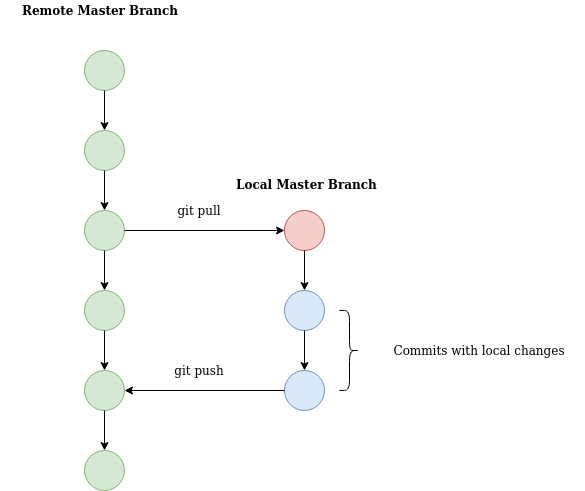
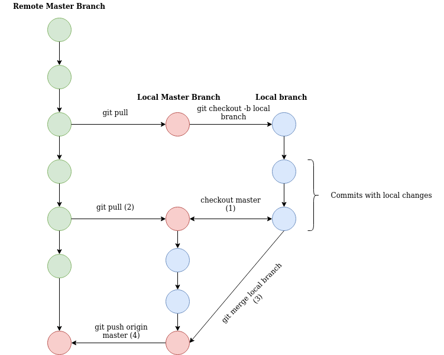

# Git Tutorial #

### Task ###

* Solve the 3 problems palindrome, sort, decimal too binary
* palindrome
  * should be able to check if the word is a palindrome or not.
  * lies under the directory palindrome
* sort 
  * an array of integers in decending or acending order.
  * lies under the directory sort
* decimal too binary
  * convert a integer to a char string equal the given decimal
  * lies under the directory convert2Binary

### What is git? ###

* Version control system to be able to work with the same project simultaneously in a smooth way :D

* https://en.wikipedia.org/wiki/Git

* Sites that is built on git:
	* Github  
	* Bitbucket  

### How to download the repository? ###

There is multiple way to get access to a git repository
- Usually you clone it from the specific domain where the repository is created
- Downloads varies dependet on what site you use and from company to company. The principle is however the same.

* To download from this repository you have to click on the clone button in the top right corner.
* Copy the link that pops up and open a commandline terminal. (If you use windows... god help us....)
* On linux:
	* create a folder ex. <gitTutorial> at a good location on your computer
	* cd into the folder <gitTutorial>, type "git clone" and paste the link in the terminal and press enter. Command should look like this: git clone https://github.com/xannik/gitTutorial.git 
	  * (you might need to enter your github password in case you haven't changes your .gitconfig file)
	

### Working with git ###

* Basic thought of Git is to copy the project code from a shared remote repository to your local computer, work with the code and then upload your changes to the repository again.  
* To work with this efficiently and avoid uneccessary headache for you and your friends there is a feature in git that is called branches. The main project code is on the Master Branch which should always work ALWAYS!!! and then you when you clone the code to your local computer you create a local branch, that you work against. When you are finished, push your changes to the Master branch example:

Example of commands to to this procedure would be:

git pull (updates your local branch)    
git commit  
git push origin master  

What is happening on your computer is that when you clone down the master branch you will create a local master branch. This branch is a copy of the "real master branch" from that specific time that you cloned it. Since many people are updating master with their fixes, your current master might not be updated to the remote master when you are done with your changes which will end up in a merge conflict.

To avoid this, a good idéa is to have your local master clean and make sure that it is updated with real master before you push your changes. Here is an image trying to describe a good work flow. 

The small texts with numbers are suppose to be a step by step procedure for when you are about to push your changes to the remote master branch. Keeping your local master updated is key and it should HURT IN YOUR WHOLE BODY before you do a git pull and update your local master.

With this way of working headache is minimal, there is however cases where you have to be careful. If 2 people work in the same file then one of you will most likley get merge conflict which you will have to solve localy before you push your own changes. (depends on who merges their own changes first on the remote master branch)
So my tip for this is:
* don't work in the same file (it is stupid and inefficient)
* if you need to work in the same file however keep one another updated on what you are changing in the file or do pair programming.

Basic git commands:

* ** git pull origin master
	* downloads the code from the remote repository to your local master branch and merges your code with the remote code
	* origin is the keyword for remote branches. you can also have your own remote branch in parallell with the master branch. in that case you would type pull origin myRemoteBranch
	* a usefull flag to add to git pull is --rebase which will basically amend instead of merge your commits.
* ** git push origin master 
	* uploads your changes to the remote master branch
* ** git commit
	* Stores your current changes and applies a commit id. VERY usefull if you want to backtrack and have observability of your project flow. Also contains a commit message (hopefully) describing the changes that has been done.
	* with commits you can also work in different ways. Either you do multiple commits of your changes and then push that to master, for example: 
		* local change 1
		* commit 1
		* local change 2
		* commit 2
	* This will however lead to a multiple commit push later when you want to push to origin master. This has its pros and cons
		* pros: Easier for you to track what you have done and pin point what change you did to brake the code.
		* cons: a hell to review if you would like someone to review your code
	* Another way or working with git commit is use the flag --amend. which merges your multiple commits into 1 commit
		* local change 1 
		* commit
		* local change 2
		* commit
		* pros: easier to review
		* cons: hard to backtrack if you break the code
	* Since adding a message to your commit is mandatory you can either type your message directly when you push
		* git commit -m "this is a commit message"
		* git commit (this will open a chosen text editor)
			* to modify the text editor type: git config --global core.editor "emacs".
			* emacs is my preferable editor (best editor in the world.)
			* **PROTIP!** I would recommend to atleast learn vi, vim or emacs since these are most common inbuilt editors in embedded software
				* typical scenario: you need to change a file on a server, you ssh in to the server and then you can open vim/emacs in that ssh session. (GUI based editors can't be opened in ssh sessions) 
* ** git log
	* key command to see the history of the repository. Displays the history stack of all the commits that have been pushed to master + your local commits that you have currently created
* ** git blame
	* basically doing what it says. git blame <filename> and you can see what person changed what lines of code in the specific file
* ** git diff
	* Displays what has been changed in your files from when you did a git pull
* ** git stash
  	* Saves the changes on your current branch that you are standing on
	* good if you have to switch branches quickly and then return to your previous branch again
* ** git apply
  	* applies the temporary changes that you stashed
* ** git pop
  	* basically the same as git apply
* ** git grep
  	* Very useful command. You can search for anything inside the git repository
	
### Make ###
This project are built with make which is a system building tool where you specify rules and dependencies to compile multiple files at once.

Make uses Makefile as its reference file to know the project structure, linkers, dependecies etc.

There are multiple tools that you can use and they are mostly used for low level languages such as c/c++
visual studio uses cmake which is an extended Make.

Everything should be prepared in this project and when you want to build your code you:
* make sure you stand in the same folder as the Makefile
* type: make help
	* this should display the rules that I have specified.
	* this will compile the program and produce an exectuable file example: program.exe
* execute the program as usual with: ./program.exe

